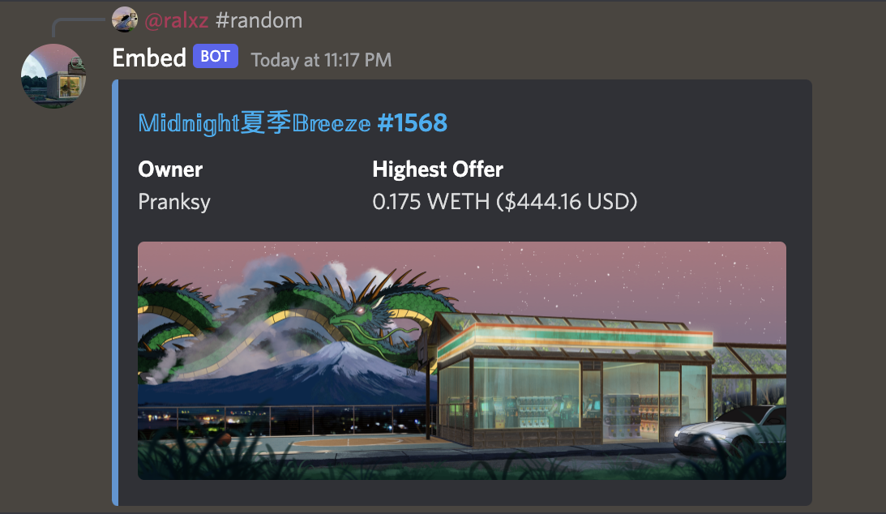

# discord-nft-embed-bot

A [discord.js](https://discord.js.org/) bot that listens to messages in channels and replies with items from an nft collection.

Originally developed for [@dutchtide](https://twitter.com/dutchtide)'s [𝕄𝕚𝕕𝕟𝕚𝕘𝕙𝕥 夏季 𝔹𝕣𝕖𝕖𝕫𝕖](https://opensea.io/collection/midnightbreeze) collection.

An OpenSea API key is needed - [request one here](https://docs.opensea.io/reference/request-an-api-key).

To run multiple instances of this bot at once check out [bot-runner](https://github.com/ryanio/bot-runner). Also check out [opensea-activity-bot](https://github.com/ryanio/opensea-activity-bot).

## Supported syntax

- `#1234`
- `#ensname.eth`
- `#openseaUsername`
- `#random` or `#rand` or `#?`

Example reply:



Example console output:

```
------------------------------------------------------------
Logged in as Dutchtide Listen Bot#8486!
Listening for messages…
------------------------------------------------------------
Message from ryanio in #🌴🎐view-the-breeze🎐🌴:
> #random
Fetching #2248…
Replied with #2248
------------------------------------------------------------
```

Provided metadata fields:

- Owner
- Last sale
- Listed for
- Highest offer

You can add specific properties of the nft by formatting `asset.traits` and adding to the `fields` array.

## Setup

### Env

Please define the following env variables for the repository to work as intended.

#### APIs

- `DISCORD_TOKEN`
- `OPENSEA_API_TOKEN`
- `INFURA_PROJECT_ID`

#### Project-specific

- `TOKEN_NAME`
- `TOKEN_ADDRESS`
- `MIN_TOKEN_ID`
- `MAX_TOKEN_ID`

#### Optional

- `RANDOM_INTERVALS`
  - A comma-separated list of `channelId=intervalInMinutes` e.g. `662377002338091020=5,924064011820077076=10` to send random items to channels in intervals.

### Bot

To get your `DISCORD_TOKEN`, [create a Discord app](https://discord.com/developers/applications). Create a bot with the permissions: `Read Messages/View Channels`, `Send Messages`, and `Embed Links`. Then [add your bot to your server](https://discordjs.guide/preparations/adding-your-bot-to-servers.html#bot-invite-links). The bot will listen and reply to messages in all of the channels it has access to.

The `DISCORD_TOKEN` looks like this: `OTE5MzY5ODIyNzEyNzc5NzUz.YBuz2g.x1rGh4zx_XlSNj43oreukvlwsfw`

If your discord bot is not able to post messages ensure it is added to the channels you've specified and it has the permissions to `Read Messages/View Channels`, `Send Messages` and `Embed Links`, and that you have also enabled `Message Content Intent` on your bot page.

### Run

`yarn start`

#### Running on a server

I recommend to use DigitalOcean over Heroku for improved stability. Heroku servers can restart (cycle) which can lead to missed messages.

My preferred setup is a $5/month Basic Droplet with Ubuntu. Install Node v16 and yarn, clone this repo, cd into it, run `yarn`, install [pm2](https://pm2.keymetrics.io/) with `yarn global add pm2`, set env vars, run `pm2 start yarn -- start`. Monitor with `pm2 list` and `pm2 logs`. Add log rotation module to keep default max 10mb of logs with `pm2 install pm2-logrotate`. To respawn after reboot, set your env vars in `/etc/profile`, then run `pm2 startup` and `pm2 save`.

You can support this repository (and get a promotional discount) by using the referral badge below:

[](https://www.digitalocean.com/?refcode=3f8c76216510&utm_campaign=Referral_Invite&utm_medium=Referral_Program&utm_source=badge)

##### Heroku

A `Procfile` is included for easy use.

Clone this repo, push it to heroku, set up the environment variables above, and spin up a worker with `heroku ps:scale web=0 worker=1`

Then watch the logs with `heroku logs --tail`
